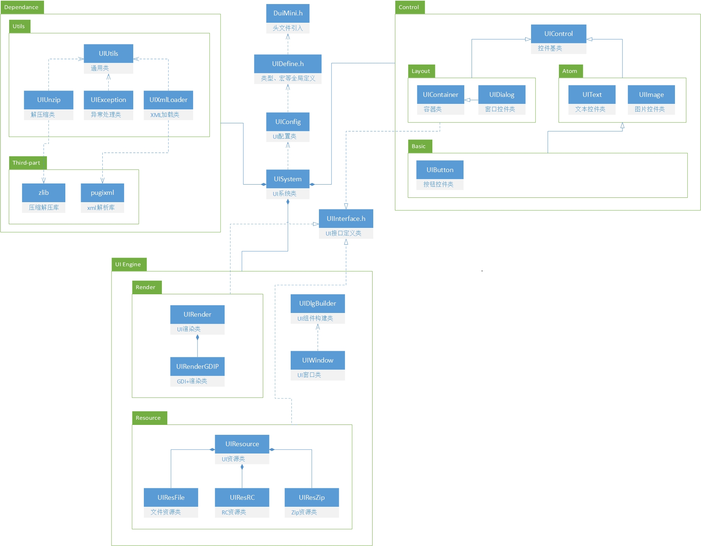

# 目录和框架结构

```text
├─主程序.exe
└─uires
  ├─uires.xml  主配置文件
  ├─skin
  │    ├─default  默认皮肤
  │    │  └─main  主界面
  │    ├─system   系统皮肤（改变皮肤时不变）
  │    └─xxx      其他皮肤
  ├─string     字符串
  └─xml        XML文件
```



