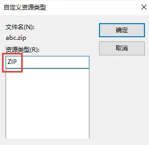

# 资源文件

## 支持格式

DuiMini支持三种资源格式：常规文件（默认），打包文件，RC资源


每个程序仅可同时使用一种，多次设定只有**最后一次设定**才会生效。



程序中使用路径均为资源目录的相对路径或者绝对路径


## **初始化代码：**



```cpp
UIResource::SetResType(kRT_File);
UIResource::SetResInfo(资源根目录，即uires.xml文件所在目录，不包含末尾\\，默认为根目录下的uires文件夹，可修改UIDefine.h中的DEFAULT_RESFOLDER宏来修改此类型);
```



```cpp
UIResource::SetResType(kRT_Package);
UIResource::SetResInfo(ZIP文件全路径，可自行修改后缀，但必须是标准ZIP文件）
```



资源视图中右击—添加资源—导入，选择“所有文件”类型，点击要导入的ZIP包（只能添加一个），在自定义资源类型中修改资源类型为\*\*ZIP\*\*（默认为ZIP，可修改`UIDefine.h`中的`RESOURCE_KIND`宏来修改此类型，但必须保持一致）。



```cpp
UIResource::SetResType(kRT_RC);
UIResource::SetResInfo(UStr((int)(ZIP资源ID)));
```




通常可使用`UIResource::SetResPath(UIUtils::GetCurrentDir());`设定程序目录为资源根目录。


